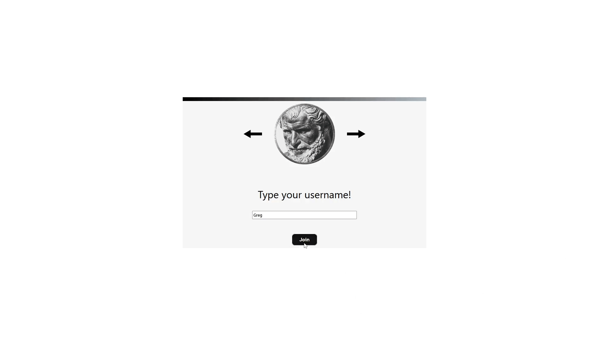

# Wikirush
> Multiplayer implementation of [Wiki Game](https://en.wikipedia.org/wiki/Wikipedia:Wiki_Game) made with Django&React&Websockets.


## Overview
This is a multiplayer version of Wiki Game, also known as the Wikipedia race, is a race between any number of participants, using wikilinks to travel from one Wikipedia page to another. The first person to reach the destination page, wins the race. 

## Preview

<p align="center">
    
</p>

## Key points
- WebSocket Communication
- Lobby management(creating,joining,dynamic lobby owner)
- Live view of other players current article

## How to run


To clone and run this application, you'll need [Git](https://git-scm.com) and [Docker](https://www.docker.com/) From your command line:
```bash
# Clone this repository
$ git clone https://github.com/CMD451/Wikirush

# Go into the repository
$ cd Wikirush

# Run docker compose
$ docker compose up
```
After containers are created frontend site should be available on: http://localhost:3000


## License
<h5>MIT</h5>
